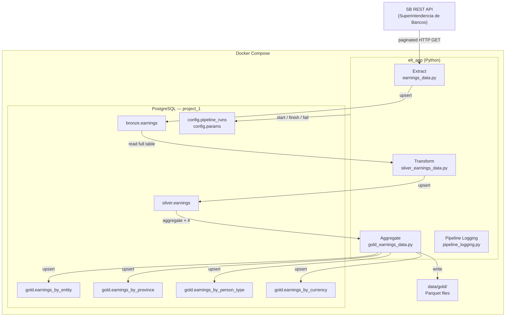

# Data Engineer Bootcamp — Earnings ETL Pipeline

## Team

| Name           | GitHub                                               |
| -------------- | ---------------------------------------------------- |
| Darvy Betances | [@darvybm](https://github.com/darvybm)               |
| Gabriel Cepeda | [@gabrielcepedag](https://github.com/gabrielcepedag) |
| José Ramírez   | [@JoseRG03](https://github.com/JoseRG03)             |

---

## Table of Contents

1. [Project Context and Goals](#1-project-context-and-goals)
2. [Dataset Selected](#2-dataset-selected)
3. [Solution Architecture](#3-solution-architecture)
4. [ETL Techniques Applied](#4-etl-techniques-applied)
5. [Transformation Techniques](#5-transformation-techniques)
6. [Data Layers](#6-data-layers)
7. [Pipeline Metadata Logging](#7-pipeline-metadata-logging)
8. [Unit Tests](#8-unit-tests)
9. [Installation and Running Instructions](#9-installation-and-running-instructions)
10. [Environment Variables](#10-environment-variables)
11. [Project Structure](#11-project-structure)
12. [AWS Deployment](#12-aws-deployment)
13. [Lessons Learned](#13-lessons-learned)

---

## 1. Project Context and Goals

This project implements a fully automated ETL pipeline that extracts financial deposit data from the Superintendencia de Bancos (SB) public API, transforms it through a medallion architecture (Bronze → Silver → Gold), and loads the results into a PostgreSQL database and local Parquet files.

**Business questions answered:**

- Which banks hold the most deposits?
- Which provinces concentrate the most savings?
- How do retail (Natural) vs. corporate (Jurídico) deposits compare?
- What is the dollarization level of the financial system?

---

## 2. Dataset Selected

**Source:** Superintendencia de Bancos de la República Dominicana — Public API

**Dataset:** Deposits by financial entity, province, person type and currency

**Update frequency:** Monthly

**Fields extracted:**

| Field (API)                       | Description                                 |
| --------------------------------- | ------------------------------------------- |
| `periodo`                         | Reporting month (YYYY-MM)                   |
| `entidad`                         | Financial institution name                  |
| `tipoEntidad`                     | Entity type code (e.g. BM = Banco Múltiple) |
| `provincia`                       | Province name                               |
| `region`                          | Geographic region                           |
| `persona`                         | Depositor type (Natural / Jurídico)         |
| `divisa`                          | Currency (DOP / USD)                        |
| `cantidadInstrumento`             | Number of deposit instruments               |
| `balance`                         | Total deposit balance                       |
| `tasaPromedioPonderadoPorBalance` | Portfolio-weighted average interest rate    |

---

## 3. Solution Architecture



---

## 4. ETL Techniques Applied

### Extract

- **Live dataset** — data is pulled from a live REST API (SB API) that updates monthly.
- **Incremental extract** — the pipeline reads `last_pipeline_execution` from `config.params` to determine the start date. On the first run a full load is performed; on subsequent runs only new months are fetched.
- **Pagination** — the API is paginated; the pipeline loops through pages until a partial page signals the end of data.

### Load

- **Upsert load** — all three layers (Bronze, Silver, Gold) use PostgreSQL `INSERT … ON CONFLICT DO UPDATE` keyed on composite primary keys, ensuring idempotent reruns.
- **Dual destination (Gold)** — each Gold table is written to both PostgreSQL and a local Parquet file, designed so that switching to S3 only requires changing `PARQUET_OUTPUT_DIR` to an S3 URI.

### Incremental State Tracking

The `config.params` table persists two parameters across runs:

| param_name                | Description                               |
| ------------------------- | ----------------------------------------- |
| `last_pipeline_execution` | Last successfully loaded period (YYYY-MM) |
| `records_per_page`        | API pagination size (default 500)         |

---

## 5. Transformation Techniques

| #   | Technique                          | Where applied                                                                                                  |
| --- | ---------------------------------- | -------------------------------------------------------------------------------------------------------------- |
| 1   | **Renaming**                       | Bronze → Silver: Spanish API fields renamed to English (`periodo` → `period_date`, `entidad` → `entity`, etc.) |
| 2   | **Data type casting**              | `periodo` (string) → `period_date` (date); numeric fields cast to float/int                                    |
| 3   | **Filtering**                      | Rows with null `balance` or `periodo` are dropped in the Silver transform                                      |
| 4   | **Aggregation — sum**              | Gold: `total_balance = SUM(balance)`, `total_instruments = SUM(instrument_count)`                              |
| 5   | **Aggregation — weighted average** | Gold: `avg_weighted_rate = SUM(balance × rate) / SUM(balance)` — true portfolio-weighted rate                  |
| 6   | **Grouping**                       | Gold: `GROUP BY` period + dimension (entity, province, person_type, currency)                                  |
| 7   | **Calculation**                    | Gold: intermediate `balance_x_rate = balance × weighted_avg_rate_by_balance`                                   |

**7 transformation techniques applied.**

---

## 6. Data Layers

### Bronze — Raw Ingested Data (`bronze.earnings`)

Stores raw API records with original Spanish/camelCase field names. No transformation is applied — it is an exact replica of the API response, kept for auditability and reprocessing.

### Silver — Cleaned and Typed Data (`silver.earnings`)

Applies renaming, type casting, and null filtering.

| Column                         | Type    | Source field                      |
| ------------------------------ | ------- | --------------------------------- |
| `period_date`                  | date    | `periodo`                         |
| `entity`                       | string  | `entidad`                         |
| `entity_type`                  | string  | `tipoEntidad`                     |
| `province`                     | string  | `provincia`                       |
| `region`                       | string  | `region`                          |
| `person_type`                  | string  | `persona`                         |
| `currency`                     | string  | `divisa`                          |
| `instrument_count`             | integer | `cantidadInstrumento`             |
| `balance`                      | float   | `balance`                         |
| `weighted_avg_rate_by_balance` | float   | `tasaPromedioPonderadoPorBalance` |

### Gold — Aggregated Analytics Tables

| Table                          | Group By                         | Metrics                                             |
| ------------------------------ | -------------------------------- | --------------------------------------------------- |
| `gold.earnings_by_entity`      | period_date, entity, entity_type | total_balance, total_instruments, avg_weighted_rate |
| `gold.earnings_by_province`    | period_date, province, region    | total_balance, total_instruments, avg_weighted_rate |
| `gold.earnings_by_person_type` | period_date, person_type         | total_balance, total_instruments, avg_weighted_rate |
| `gold.earnings_by_currency`    | period_date, currency            | total_balance, total_instruments, avg_weighted_rate |

---

## 7. Pipeline Metadata Logging

Every pipeline execution is recorded in `config.pipeline_runs`:

| Column              | Description                                |
| ------------------- | ------------------------------------------ |
| `run_id`            | Auto-incremented identifier                |
| `pipeline_name`     | Name of the pipeline (`earnings_pipeline`) |
| `start_time`        | UTC timestamp when the run started         |
| `end_time`          | UTC timestamp when the run finished        |
| `status`            | `running` → `success` or `failed`          |
| `records_extracted` | Records pulled from the SB API             |
| `records_loaded`    | Records written to Silver                  |
| `error_message`     | Exception message if the run failed        |

Query to inspect runs:

```sql
SELECT * FROM config.pipeline_runs ORDER BY run_id DESC;
```

---

## 8. Unit Tests

Tests are in `etl_project/tests/` and run with pytest. All tests use mocks — no database or network connection required.

| File                            | Coverage                                                   |
| ------------------------------- | ---------------------------------------------------------- |
| `test_earnings_extract_load.py` | `assets/earnings_data.py` — Bronze extract and load        |
| `test_earnings_transform.py`    | `assets/silver_earnings_data.py` — Silver transform        |
| `test_gold_earnings.py`         | `assets/gold_earnings_data.py` — Gold aggregation and load |
| `test_config_data.py`           | `assets/config_data.py` — Config param CRUD                |

Run all unit tests:

```bash
cd etl_project
pytest tests/ -v
```

---

## 9. Installation and Running Instructions

### Prerequisites

- [Docker Desktop](https://www.docker.com/products/docker-desktop/) installed and running
- Git

### Setup

**1. Clone the repository**

```bash
git clone <repository-url>
cd data-engineer-bootcamp
```

**2. Configure environment variables**

```bash
cp .env.template .env
# Open .env and add your SB_API_KEY
```

**3. Start the pipeline**

```bash
docker compose up
```

This will:

- Start PostgreSQL and initialize the schema automatically on first run
- Execute the ETL pipeline (`elt_app`)
- Start pgAdmin at http://localhost:5050

**4. Access pgAdmin**

- URL: http://localhost:5050
- Email/Password: as configured in `.env`
- Register server: host = `postgres`, port = `5432`, database = `project_1`

**5. Verify results**

```sql
-- Pipeline run history
SELECT * FROM config.pipeline_runs ORDER BY run_id DESC;

-- Gold layer sample
SELECT * FROM gold.earnings_by_entity LIMIT 10;
SELECT * FROM gold.earnings_by_currency LIMIT 10;
```

**6. Force a full reload**

```sql
UPDATE config.params SET param_value = NULL WHERE param_name = 'last_pipeline_execution';
```

Then restart the container.

### Run unit tests locally

```bash
cd etl_project
pip install -r requirements.txt
pytest tests/ -v
```

---

## 10. Environment Variables

| Variable             | Description                     | Default      |
| -------------------- | ------------------------------- | ------------ |
| `DB_HOST`            | PostgreSQL hostname             | `postgres`   |
| `DB_PORT`            | PostgreSQL port exposed to host | `5432`       |
| `DB_USER`            | Database username               | `postgres`   |
| `DB_PASSWORD`        | Database password               | —            |
| `DB_NAME`            | Database name                   | `project_1`  |
| `SB_API_KEY`         | Subscription key for the SB API | —            |
| `PGADMIN_EMAIL`      | pgAdmin login email             | —            |
| `PGADMIN_PASSWORD`   | pgAdmin login password          | —            |
| `DEFAULT_START_DATE` | Start date for full load        | `2026-01-01` |
| `PARQUET_OUTPUT_DIR` | Local path for Parquet output   | `data/gold`  |
| `CONFIG_SCHEMA`      | Schema for config tables        | `config`     |
| `BRONZE_SCHEMA`      | Schema for raw data             | `bronze`     |
| `SILVER_SCHEMA`      | Schema for cleaned data         | `silver`     |
| `GOLD_SCHEMA`        | Schema for aggregated data      | `gold`       |

---

## 11. Project Structure

```
data-engineer-bootcamp/
├── docker-compose.yml
├── .env.template
├── README.md
├── db/
│   └── create-db-schema.sql        # Schema init (runs once on first Docker start)
├── data/
│   └── gold/                       # Parquet output (mounted Docker volume)
│       ├── earnings_by_entity.parquet
│       ├── earnings_by_province.parquet
│       ├── earnings_by_person_type.parquet
│       └── earnings_by_currency.parquet
└── etl_project/
    ├── Dockerfile
    ├── requirements.txt
    ├── main.py                     # Entry point
    ├── connectors/
    │   ├── postgresql.py           # PostgreSQL client (SQLAlchemy + upsert)
    │   └── sb_api.py               # SB REST API client
    ├── assets/
    │   ├── earnings_data.py        # Bronze: extract + load
    │   ├── silver_earnings_data.py # Silver: transform + load
    │   ├── gold_earnings_data.py   # Gold: aggregate + dual load (PG + Parquet)
    │   ├── config_data.py          # Config param CRUD (incremental state)
    │   └── pipeline_logging.py     # Pipeline run metadata logging
    ├── pipelines/
    │   └── extract_earnings.py     # Full pipeline orchestration (Bronze → Silver → Gold)
    └── tests/
        ├── test_earnings_extract_load.py
        ├── test_earnings_transform.py
        ├── test_gold_earnings.py
        └── test_config_data.py
```

---

## 12. AWS Deployment

### Services Required

| Service                           | Purpose                                                     |
| --------------------------------- | ----------------------------------------------------------- |
| ECR (Elastic Container Registry)  | Store the Docker image                                      |
| ECS (Elastic Container Service)   | Run the pipeline as a scheduled task                        |
| RDS (Relational Database Service) | PostgreSQL database in the cloud                            |
| S3 (Simple Storage Service)       | Alternative/additional storage for Parquet files            |
| IAM Role                          | Permissions for ECS task to access RDS, S3, Secrets Manager |
| Secrets Manager                   | Store DB credentials and API key securely                   |

### AWS Infrastructure briefing

The Dockerfile created based on the pipeline was registered into ECR, and then scheduled to run monthly with an ECS Scheduled Task. The Postgres database used in production is an RDS t4.micro instance, and parquet files are stored in an S3 bucket so data scientists can easily access the data. Roles were created for each of the AWS users, giving administrator access for the critical AWS services that were used as well as for the billing platform, to be able to read up on the current budget.

Missing:
Secrets Manager
Deployment Commands

## 13. Lessons Learned

1. Data transformations must always be done with business needs in mind, and not just for the sake of transforming data. This will allow for a final dataset that better suits the needs of the end users.
2.
